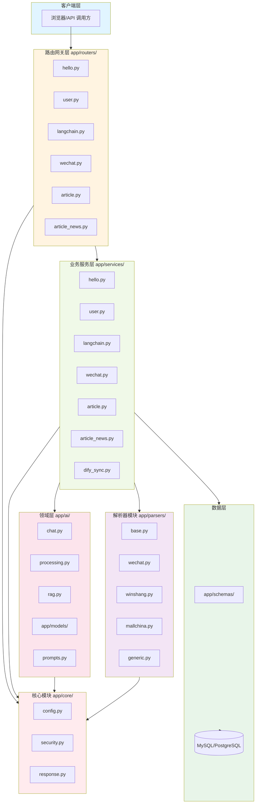

# CLAUDE.md

> 最后更新：2026-04-07

## 项目概述

基于《企业级项目目录规范与多应用路由网关架构》构建的 FastAPI 企业级项目模板，采用 MVC 分层架构，支持多应用模块化路由。

**技术栈**：FastAPI + Pydantic + Tortoise ORM + LangChain

## 架构图



## 模块索引

| 模块 | 路径 | 职责 | CLAUDE.md |
|------|------|------|-----------|
| 根模块 | `/` | 应用引导、路由注册、中间件配置 | [CLAUDE.md](./CLAUDE.md) |
| 核心模块 | `app/core/` | 配置管理、安全认证、统一响应 | [CLAUDE.md](./app/core/CLAUDE.md) |
| AI 模块 | `app/ai/` | 聊天对话、文本处理、RAG 检索 | [CLAUDE.md](./app/ai/CLAUDE.md) |
| 路由控制器 | `app/routers/` | HTTP 请求处理与路由分发 | - |
| 业务服务 | `app/services/` | 业务逻辑、第三方集成 | - |
| 数据模型 | `app/models/` | Tortoise ORM 数据库模型 | - |
| 数据契约 | `app/schemas/` | Pydantic 请求/响应校验 | - |
| 文章解析器 | `app/parsers/` | 多网站文章解析策略 | [CLAUDE.md](./app/parsers/CLAUDE.md) |
| 命令行 | `app/command/` | CLI 命令与后台任务 | - |

## 模块结构图

```mermaid
graph TD
    Root["(根) fastapi-tp6"] --> App["app/"];
    
    App --> Core["core"];
    App --> AI["ai"];
    App --> Routers["routers"];
    App --> Services["services"];
    App --> Models["models"];
    App --> Schemas["schemas"];
    App --> Parsers["parsers"];
    App --> Command["command"];
    
    Core --> CoreConfig["config.py"];
    Core --> CoreSecurity["security.py"];
    Core --> CoreResponse["response.py"];
    
    AI --> AIChat["chat.py"];
    AI --> AIProc["processing.py"];
    AI --> AIRag["rag.py"];
    AI --> AIModels["models.py"];
    AI --> AIPrompts["prompts.py"];
    
    Routers --> RHello["hello.py"];
    Routers --> RUser["user.py"];
    Routers --> RLangChain["langchain.py"];
    Routers --> RWechat["wechat.py"];
    Routers --> RArticle["article.py"];
    Routers --> RArticleNews["article_news.py"];
    
    Services --> SHello["hello.py"];
    Services --> SUser["user.py"];
    Services --> SLangChain["langchain.py"];
    Services --> SWechat["wechat.py"];
    Services --> SArticle["article.py"];
    Services --> SArticleNews["article_news.py"];
    Services --> SDify["dify_sync.py"];
    
    Models --> MUser["user.py"];
    Models --> MArticle["article_news.py"];
    
    Parsers --> PBase["base.py"];
    Parsers --> PWechat["wechat.py"];
    Parsers --> PWinshang["winshang.py"];
    Parsers --> PMallChina["mallchina.py"];
    Parsers --> PGeneric["generic.py"];

    click CoreConfig "./app/core/CLAUDE.md" "查看核心模块文档"
    click AIChat "./app/ai/CLAUDE.md" "查看 AI 模块文档"
    click RHello "./app/routers/CLAUDE.md" "查看路由模块文档"
    click SHello "./app/services/CLAUDE.md" "查看服务模块文档"
    click MUser "./app/models/CLAUDE.md" "查看模型模块文档"
    click PBase "./app/parsers/CLAUDE.md" "查看解析器模块文档"
```



## 运行与开发

### 使用 uv 工具链（推荐）

```bash
# 安装 uv (macOS)
brew install uv

# 创建虚拟环境
uv venv

# 激活虚拟环境
source .venv/bin/activate

# 安装依赖
uv pip install -r requirements.txt

# 启动开发服务器
uv run uvicorn app.main:app --reload --host 0.0.0.0 --port 8000
```

### 环境配置

复制 `.env.example` 为 `.env` 并修改配置：

```bash
cp .env.example .env
```

关键配置项：
- `DATABASE_URL`: 数据库连接
- `JWT_SECRET`: JWT 密钥（生产环境必须修改）
- `DEBUG`: 调试模式
- `DIFY_API_KEY`: Dify API 密钥（可选）
- `DIFY_KB_DATASET_ID`: Dify 知识库 ID（可选）

## API 路由总览

| 路由前缀 | 模块 | 说明 |
|----------|------|------|
| `/api/v1/hello` | Hello | Hello World 示例、统一响应演示 |
| `/api/v1/users` | User | 用户 CRUD 操作 |
| `/api/v1/langchain` | LangChain | AI 聊天、文本处理、RAG 查询 |
| `/api/v1/wechat` | Wechat | 微信公众号文章解析 |
| `/api/v1/articles` | Article | 文章解析与爬取 |
| `/api/v1/article` | ArticleNews | 资讯文章 CRUD 与向量同步 |

## 统一响应格式

项目采用统一的 API 响应格式：

```json
{
  "code": 0,
  "msg": "获取成功",
  "time": 1707475200,
  "data": {}
}
```

核心组件：
- **ErrorCodeManager**: 错误码管理器，支持动态注册
- **ResponseBuilder**: 响应构建器，提供 `success()`, `error()`, `paginated()` 等方法
- **ApiException**: 业务异常类，抛出后自动转换为统一响应

## 编码规范

### 分层职责

| 层级 | 目录 | 职责 |
|------|------|------|
| Controller | `app/routers/` | HTTP 请求参数处理、委派业务层、返回响应 |
| Service | `app/services/` | 核心业务逻辑、事务处理、第三方集成 |
| Domain | `app/ai/` | AI 领域逻辑、流水线工厂 |
| Model | `app/models/` | 数据库表结构映射（Tortoise ORM） |
| Schema | `app/schemas/` | 请求/响应数据校验（Pydantic） |
| Parser | `app/parsers/` | 文章解析策略（策略模式） |

### 命名约定

- 路由文件：`routers/<module>.py`，使用 `APIRouter`
- 服务文件：`services/<module>.py`，使用 `<Module>Service` 类
- 模型文件：`models/<module>.py`，继承 `tortoise.models.Model`
- Schema 文件：`schemas/<module>.py`，继承 `pydantic.BaseModel`

## 扩展新模块

1. `app/routers/<module>.py` - 创建路由
2. `app/services/<module>.py` - 创建业务逻辑
3. `app/schemas/<module>.py` - 创建数据模型
4. `app/models/<module>.py` - 创建数据库模型（如需要）
5. 在 `app/main.py` 注册路由

## AI 使用指引

使用本项目的 AI 功能时：

1. **了解架构**：AI 核心逻辑在 `app/ai/` 目录，服务层在 `app/services/langchain.py`
2. **配置模型**：在 `app/ai/models.py` 中配置 LLM 实例
3. **自定义 Prompt**：在 `app/ai/prompts.py` 中编辑提示词模板
4. **调用接口**：通过 `/api/v1/langchain/*` 系列接口使用 AI 功能

## 变更记录 (Changelog)

### 2026-04-07 - 项目初始化

- 生成根级 CLAUDE.md 与模块级 CLAUDE.md
- 创建 `.claude/index.json` 项目索引
- 完善项目架构文档与模块说明

### 之前版本

详见 Git 提交历史

## 覆盖率报告

| 统计项 | 数值 |
|--------|------|
| 总文件数 | 45 |
| 已扫描文件 | 45 |
| 覆盖率 | 100% |
| 模块数 | 9 |
| 已生成文档模块 | 4 |

**缺口清单**：
- 缺少单元测试（推荐添加 pytest）
- 部分模块未生成独立 CLAUDE.md

## 下一步建议

1. 为 `app/routers/`、`app/services/`、`app/models/`、`app/schemas/` 生成独立 CLAUDE.md
2. 添加 pytest 测试框架与单元测试
3. 配置 CI/CD 流程
